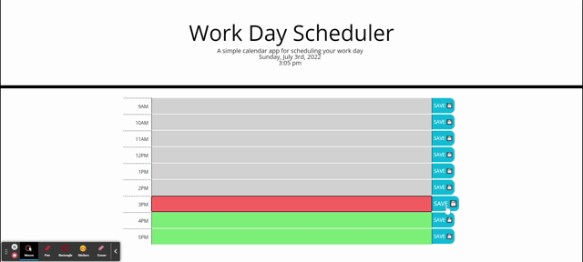

# daily-planner - 
Responsive Daily Planner

➡️ [DEPLOYED APPLICATION](https://ccaitano.github.io/daily-planner/)

## **Description**

The `Work Day Scheduler` allows the user to schedule events throughout the hours of 9am to 6pm. The current date and time is displayed on the top of the page. The present time block is colored in red, future time blocks are colored in green and past time blocks are colored gray. The user must input their events in the applicable text field and click on the corresponding "SAVE" button to save their data to their local storage.

## **Table of Contents**

- [Installation](#installation)
- [Usage](#usage)
- [License](#license)
- [Technology](#technology)
- [Questions](#questions)

## **Installation 💽**

To install this application, make a `clone` of this repository to your local machine. Open the repository in your code editor of choice, and open the `index.html` file in your browser 🖥️

## **Usage 📜**

Visit the [deployed site](https://ccaitano.github.io/daily-planner/), then:

- Enter scheduled activites in the applicable time block text field
- Click corresponding "SAVE" button to save data to local storage

## **License 🎫**

MIT License

Copyright &copy; 2022 Cheryl Caitano

Permission is hereby granted, free of charge, to any person obtaining a copy
of this software and associated documentation files (the "Software"), to deal
in the Software without restriction, including without limitation the rights
to use, copy, modify, merge, publish, distribute, sublicense, and/or sell
copies of the Software, and to permit persons to whom the Software is
furnished to do so, subject to the following conditions:

The above copyright notice and this permission notice shall be included in all
copies or substantial portions of the Software.

THE SOFTWARE IS PROVIDED "AS IS", WITHOUT WARRANTY OF ANY KIND, EXPRESS OR
IMPLIED, INCLUDING BUT NOT LIMITED TO THE WARRANTIES OF MERCHANTABILITY,
FITNESS FOR A PARTICULAR PURPOSE AND NONINFRINGEMENT. IN NO EVENT SHALL THE
AUTHORS OR COPYRIGHT HOLDERS BE LIABLE FOR ANY CLAIM, DAMAGES OR OTHER
LIABILITY, WHETHER IN AN ACTION OF CONTRACT, TORT OR OTHERWISE, ARISING FROM,
OUT OF OR IN CONNECTION WITH THE SOFTWARE OR THE USE OR OTHER DEALINGS IN THE
SOFTWARE.

## **Technology 🖥️**

- [JavaScript](https://www.javascript.com/) Scripting Language
- [HTML](https://html.com/) Markup Language
- [CSS](https://www.w3schools.com/css/) Stylesheet Language
- [Bootstrap](https://getbootstrap.com/) Bootstrap Toolkit
- [Moment.js](https://momentjs.com/) Moment.js 
- [jQuery](https://jquery.com/) jQuery Library

## **Questions ❓**

For any questions or contributions please contact me on Github or by e-mail:

[Github Profile](https://www.github.com/ccaitano)  
[Email Me](mailto:cheryl.caitano@gmail.com)